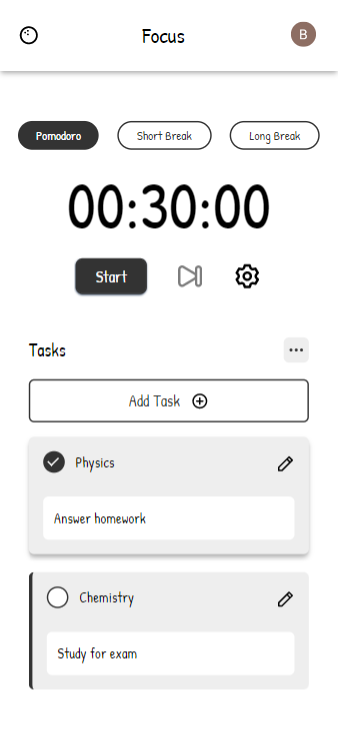
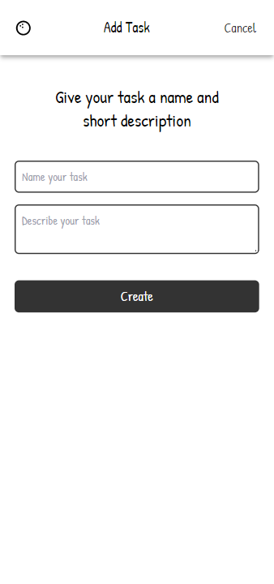
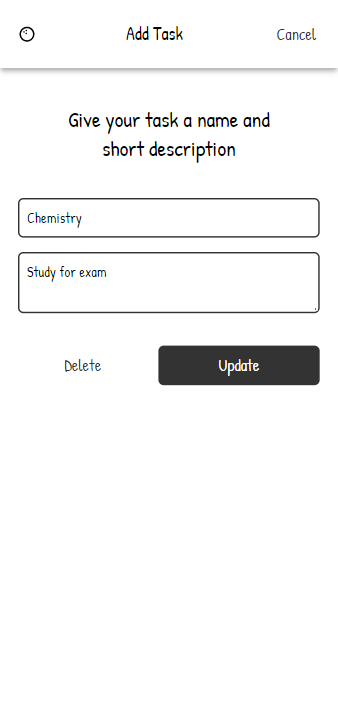
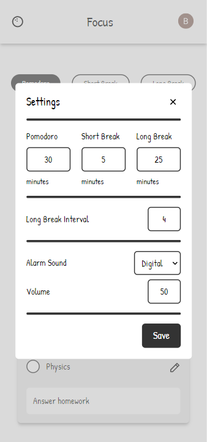

# Pomodoro

A task tracker app created with the T3 Stack. This app was inspired by the [Pomofocus](https://pomofocus.io/app) web app and the [Figma Paper Wireframe Kit](https://www.figma.com/community/file/1075811850250564922).

## Screenshots (Mobile View)

- Dashboard

  

- Task Creation

  

- Task Updating

  

- Settings

  

## Future features

1. LOFI music player

### Working on

1. Settings refactor (input should be easier to edit)
2. UI refactor (accent colors, replace image w/ next image)
